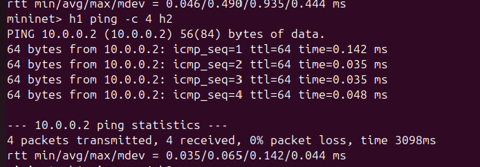
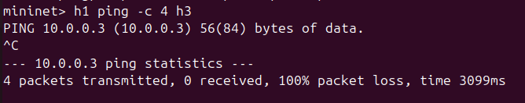
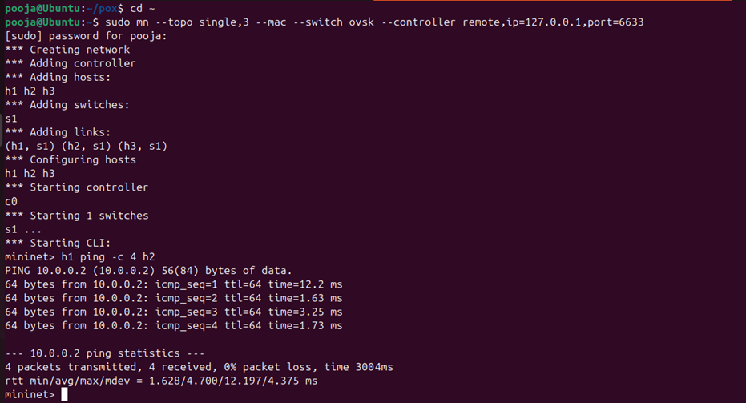

# SDN Firewall using POX and Mininet

## Objective
This project blocks traffic from h1 to h3 using POX SDN controller.

## Topology
Single switch with 3 hosts.

## Test Cases
1. h1 ping h2 -> success
2. h1 ping h3 -> blocked

## Performance
Ping latency + flow statistics

## Tools Used
- Ubuntu VM
- Mininet
- POX
- Open vSwitch

## Screenshots

### Allowed Ping

### Blocked Ping

### Flow Table

### Controller Logs

###topology_and_ping.png

