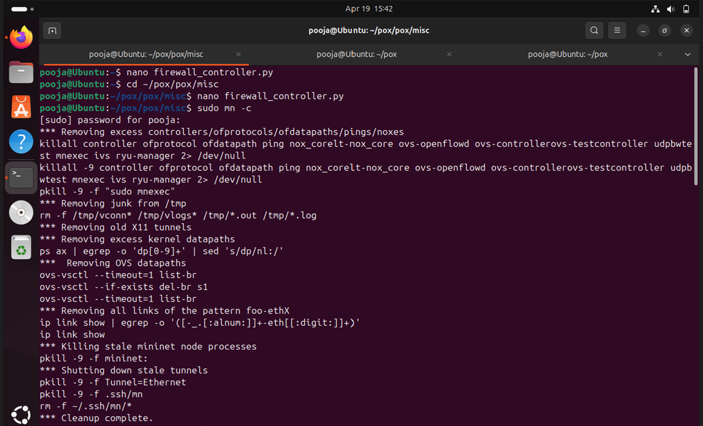
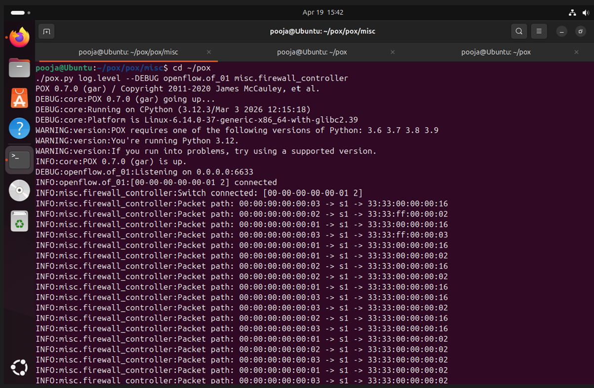
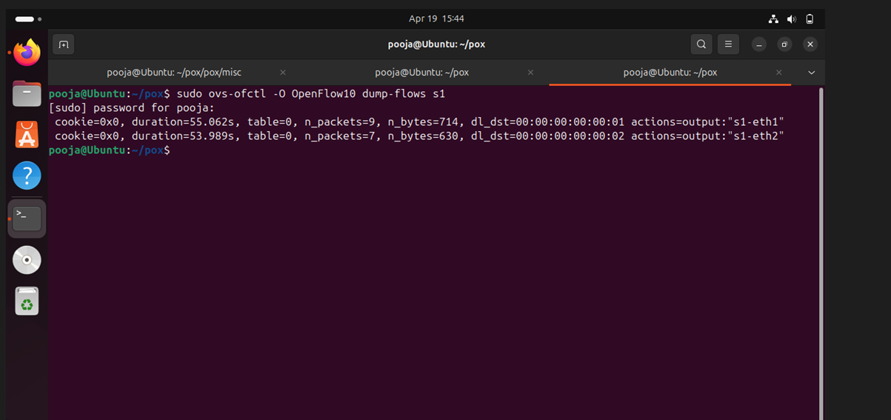

# SDN Path Tracing Tool using POX and Mininet

## 📌 Problem Statement
Design and implement an SDN-based Path Tracing Tool that:
- Identifies and displays the path taken by packets  
- Tracks flow rules  
- Identifies forwarding path  
- Displays route  
- Validates behavior using test cases  

---

## 🎯 Objective
The goal of this project is to demonstrate:
- Controller–switch interaction  
- Flow rule design (match–action)  
- Network behavior observation  

---

## 🛠️ Tools Used
- Ubuntu (Virtual Machine)  
- Mininet  
- POX Controller  
- Open vSwitch  

---

## 🧱 Network Topology
- Single switch topology  
- 3 hosts: h1, h2, h3  

---

## 🚀 Setup & Execution Steps

### Step 1: Start POX Controller
```bash
cd ~/pox
./pox.py log.level --DEBUG openflow.of_01 misc.firewall_controller
```

### Step 2: Run Mininet
```bash
sudo mn --topo single,3 --mac --switch ovsk --controller remote,ip=127.0.0.1,port=6633
```

---

## ⚙️ Controller Functionality
- Handles PacketIn events  
- Learns MAC addresses  
- Installs flow rules dynamically  
- Logs packet path (Path Tracing)  
- Blocks traffic from h1 → h3  

---

## 🧪 Test Cases

### ✅ Test Case 1: Allowed Communication
Command:
```bash
h1 ping -c 4 h2
```
Expected Result:
- Successful communication  
- 0% packet loss  

---

### ❌ Test Case 2: Blocked Communication
Command:
```bash
h1 ping -c 4 h3
```
Expected Result:
- 100% packet loss  
- Traffic blocked by controller  

---

## 📊 Flow Table Verification
Command:
```bash
sudo ovs-ofctl -O OpenFlow10 dump-flows s1
```

Expected:
- Flow entries installed  
- Match fields and actions visible  
- Packet count updates  

---

## 🖼️ Screenshots

### 🔹 Mininet Setup


---

### 🔹 Controller Logs (Path Tracing)


---

### 🔹 Allowed Communication (h1 → h2)


---

### 🔹 Blocked Communication (h1 → h3)


---

### 🔹 Flow Table Output


---

## ✅ Results
- Packet path successfully displayed in controller logs  
- Flow rules dynamically installed in switch  
- Allowed and blocked scenarios validated  
- Network behavior observed correctly  

---

## 🎓 Conclusion
This project demonstrates an SDN-based path tracing tool using POX and Mininet.  
The controller dynamically manages traffic, installs flow rules, and logs packet paths, fulfilling all required objectives.

---
